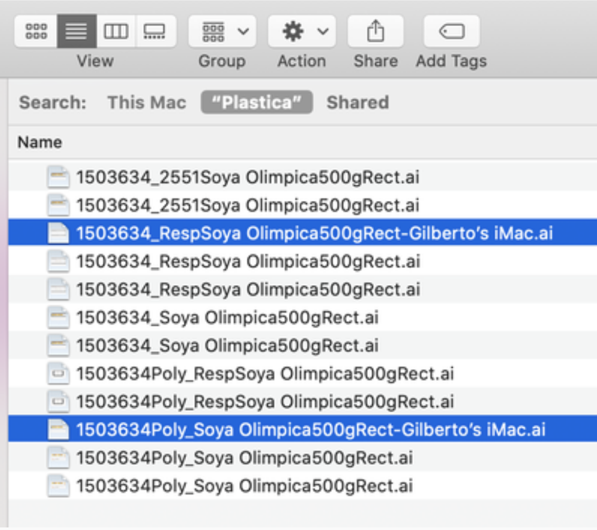
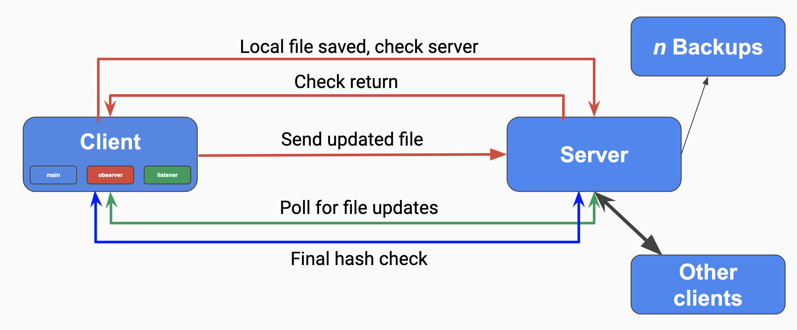
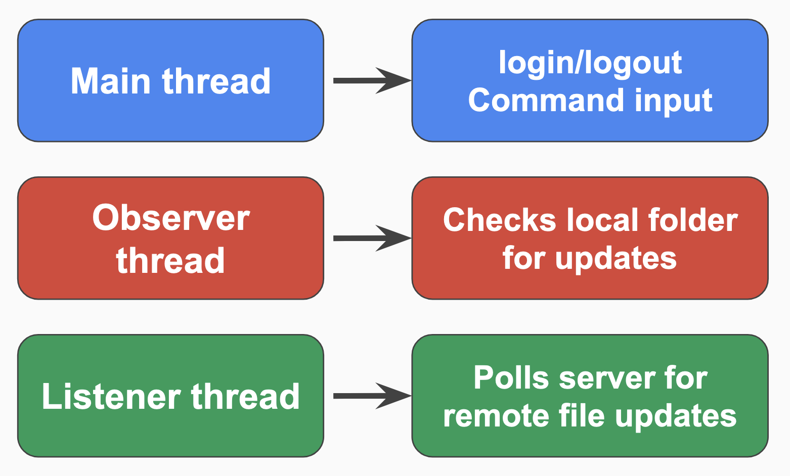

# CS262 Final Project: Engineering Notebook
## Andrew Holmes, Patrick Thornton, Lauren Cooke

As we toss around a number of distributed system concepts for our final project, we're fixating on services such as Google Drive or Microsoft OneDrive, which maintain a consistent file system across multiple computers. We feel it is high time we learn how these services operate under the hood, hence our project: a distributed file system, in which users can upload files to access at any time from any computer.

We'll give ourselves multiple tiers of development for this project:

**First Steps**
 - Users should be able to upload (push) files to a distributed file system.
 - Users should then be able to download (pull) files from said system.
 - Files should synchronize across all computers; only most recent file version available for pulling within the system (we imagine this will necessitate the use of logical clocks).

**Then...**
- Additional commands; users should be able to list out the files they have, delete ones they no longer wish to keep track of, etc.
- Usual distributed-system spit-and-shine stuff: *n*-fault tolerance via replication, persistence

### Saturday, April 29th

We're working on the very foundations of our system today, starting with the most basic operation our system needs to handle; detecting a file change. (If our system can't tell when a file in its drive is added, altered, or deleted, we're in deep trouble.) After a couple hours of experimentation with implementing this natively in Python, we find **watchdog**, a Python library that appears to be the panacea for our problems; the library, given a directory we can specify using the **os** library, can monitor all changes within that directory in a reliable manner.

We're also taking this initial phase to think about how files differ from chat messages; i.e., how our file system's implementation will differ qualitatively from our work in previous design exercises. There's a number of answers to this question we'll answer in turn, but one can be found in size. We elect to use gRPC for this project (having learned the hard way that pure socket implementations can be a bit of a headache), but gRPC has a 4 MB limit on incoming messages. This was never a problem before, since chat messages could reasonably be capped far before they hit this upper limit. But filesizes routinely exceed this amount.

To remedy the issue, we dig a little deeper into the recesses of gRPC to find these: (https://grpc.io/docs/what-is-grpc/core-concepts/#server-streaming-rpc). Namely, we'll have to employ *streams*, which permit the sending of more than 4 MB of information at once. You may notice that among gRPC's offerings, we find *bidirectional streaming*, which seems to be precisely what we're looking for; after all, we need both uploads to and downloads from our distributed file system. But this is only really necessary when uploads and downloads are simultaneous, and would require the constant maintenance of a bidirectional stream; we're free in our case to summon up a server- or client-side stream depending on our use case, and dismiss it once it's served its purpose.

So we'll stream our files in 10 KB chunks (may adjust this figure in the future) until they're fully sent. For sensibility reasons, we should impose a maximum file size for our drive. We'll arbitrarily select 2 GB, which is roughly the maximum size of a SQL BLOB (Binary Large OBject); that way, our file system should be able to store an arbitrary SQL database.

### Sunday, April 30th

We tumble into another developmental fork in the road. This one has to do with our very particular use case; what ought to happen when two clients try and edit the same file simultaneously? Due to the particular nature of distributed file systems, this situation only really arises in programs like our project, which need to monitor adjustments to existing files.

Since a distributed file system is by no means a new concept, we look at a few places where simultaneous editing of existing files is a problem; DeepNote, Microsoft OneDrive, and Google Drive. The solutions each of these programs provide to this problem can be placed on a spectrum from 'least work' to 'most work':

 - *Least work to implement, oldest-fashioned*: Lock down a file whenever it is being edited, so other clients are simply precluded from contributing. DeepNote kind of works this way; although people can edit the same Jupyter Notebook at the same time, individual cells are locked down when one person begins to edit them, and all other users have to wait for that person to click out of the cell before editing it themselves.
 - *Average work to implement, a compromise*: Allow two different clients to edit the same file at the same time, but save one client's version of the file under a different name, so users are left to handle the manual 'merging' of the two files. This is what Microsoft OneDrive does, as per the following image:
 
	After some poking around, we feel that a MAC address is a suitable identifier for a client; we'll use the Python library **uuid** to grab the client's MAC address and append it to the filename before saving in this particular situation. This avoids the blunt-seeming refusals of the option above, while also avoiding the intricate complications of the option below.
 - *Most work to implement, modern*: Allow two different clients to edit the same file via some sort of in-built concurrent editor, à la Google Drive. This is a hefty amount of work, and as we see it now, might not even make much sense given what we're focusing on (viz. maintaining a consistent file system across many computers/users). 

Of these options, we proceed with the compromise, a.k.a. the Microsoft OneDrive outcome. No matter which outcome we choose, if a user elects to edit a file currently being edited by a different client, they should be warned about the situation before they continue any further.

### Wednesday, May 3rd

By now, our general system architecture is solidified, and is worth detailing here. We provide a system map:
 
An arbitrary number of clients interface with a single server with *n* backups; when we boot the server up, we can specify how many backups we'd like, hence the variable *n*. By this point, we have the basic replication code in place, so a server crashing no longer results in a complete shutdown. We detail further the structure of the client:
 
The client (with a main, observer, and listener thread) has local files saved, which it checks against the server. The *observer thread* uses **watchdog** to monitor its local repositories for updates. When it spots an update, it hashes the updated file and checks the hash against the server's hash of the same file. If the same hash is in the server, we do nothing, as we presume (save the remote possibility of hash collisions) that the client and the server have the same file in storage. If the hash is not found in the server, we stream it over via gRPC, either using the original filename or the original filename plus the MAC address if the MAC address does not match the previous editor's MAC address. We then store the MAC address of the editing client so we can make this exact comparison in the future.

The *listener thread* listens to the server for updates by checking to see if a server's hashes fail to match any of the client's hashes. If it finds a missing file on the server that is not represented locally, it pulls to remedy the discrepancy. If a branched version (i.e. one with a different MAC address) is found on the server, the client is alerted to the situation before continuing.

So the observer thread watches local client repositories for updates, and pushes to the server when they occur; the listener thread watches network server repositories for updates, and pulls from the server when they occur; and the main thread handles the deployment of the aforementioned threads. 
 
### Friday, May 5th
We finish up most of the core functionality of our project today; namely, the uploading and syncing, or the pushing and pulling of file data from the client to the server and vise versa. Along the way, we hit a number of developmental snags, the kind that are bound to arise whenever theory turns to practice; we'll detail some of them here.

As we've discussed previously, uploads may exceed the maximum size gRPC permits for incoming messages, so gRPC's streaming capabilities are needed. What this ends up looking like in practice is a little peculiar: gRPC upload requests must be allowed to be *either* a metadata struct or a byte array representing a chunk of the file. We form a LIFO queue to line up the upload requests; metadata at the front, with the actual file in chunks behind it. What's sent to the server-side upload function ends up being an iterator through said queue. This sounds a little arbitrary, but all gRPC responses are actually delivered as iterators, so this turns out quite consistent. 

The aforementioned **watchdog** turns out to cleave rather well to our use case. In fact, it gives us a little more functionality than we actually need, as it can detect when a *directory* is modified in addition to a *file*. We have no need for directory maintenance for our program, so we explicitly ignore directory modifications and focus instead on the file change that prompted it. After the client exhibited some rather frantic behavior in early testing, we quickly decide upon a *delta*, an interval of time for which to wait before attempting to pull again; this helps minimize the chances of overcomplication or unintended behavior. 

(Speaking of unintended behavior: one current limitation of our software we are readily willing to admit is its weakness to certain pieces of file-editing software. Specifically, if a file-editing software tends to use a more sophisticated method than just editing the file right in place, our program might start to pull and push around information you'd rather not see. For instance, Vim creates *swap files* with arbitrary numerical names when editing; our program will readily pick those swap files up via an upload and proceed to sync those swap files to any user with ownership, even though they're of little use to anyone outside of an active Vim session.)

We also settle on having three backups of every file. The fact we allow our file database to contain more than one instance of a given file explains why our file SQL table lacks a primary key; we'd like for more than one file to have the ID 1, for instance, and we'd like to sort these separate versions by recency using logical clocks. (Logical clocks currently update only on uploads; we will add more cases for clock incrementation in the future if need be.) If we receive a fourth version, we delete old versions to make room for it.

Syncing works similarly, but instead of triggering on the client-side in response to local modifications, it triggers at timed intervals we can set using the constant SYNC_RATE. We have the program configured currently to sync automatically every sixty seconds (this is to give it ample time to stream any large files it might run into). Since files will have to be pulled from the server, streaming is needed here as well; this time the stream is actually written into a local file on the client-side using fwrite(). If we see that all files on the client are represented on the server in their latest versions (enforcing this latest-version requirement is the raison d'etre for an entire helper function called __latest_ver()), there are no files to pull, and we simply return a sync reply with one attribute, will_receive = false.

### Saturday, May 6th

Two developmental milestones today:

#### Client Interface
First, we finish up the client interface. More specifically, we flesh out fully what shows up when a user types '\help' into the interface:

                  -- Valid commands --
        \help -> provides the text you're seeing now
        \list -> list files you have access to
        \logout -> logs you out of your account
        \delete -> deletes all of your files from server, logs you out
        \quit -> exits the program

\help, \logout, and \quit should be relatively intuitive. \list is new to this program; it enumerates every file for which the currently-logged-in user has permissions for. These are the files this user will always receive the newest version of, no matter which computer or terminal they use to log in to our service. Regardless, if our software is deemed unsatisfactory somehow, \delete allows you to log out and take your files with you so they disappear from the server-end (provided nobody else has permissions for them; more on that in a moment.)

You may gripe that this looks like a less-featured client interface than that which we had for our first and third design exercises. In truth, however, the client interface for this program is just filigree; the heart of the program and the real meat of the functionality happens automatically, either in response to local modifications or at timed intervals, none of which involves (nor should it involve) direct user interaction via the terminal.

#### Replication, Persistence
Second, we make good on our promise to realize the design optimizations explored in the third design exercise in our own project.

Replication is realized in the form of *n*-fault tolerance. In particular, when booting up a server, we ask users to pick an ID for said server from 0 to 100, and then pick any number *n* of backups they desire and those servers' IDs. (The port of the server is determined from the ID plus a constant, in this case 50051; we usually keep the host 127.0.0.1 for convenience, but it can of course be changed.) The client will automatically connect to the the server with ID 0 when booting up. But upon a failure of a gRPC request, before crashing out, our client attempts to connect to one of its backup servers first; if it can do so, it reruns whatever command it was just running beforehand on the backup. These commands can take one of two forms; either the backslashed manual commands given through the interface, or the automatic pulling at regular intervals, both of which will switch over to a backup server in the case of a fault.

Persistence is realized in two key ways. Firstly, whenever we run a command via the client that writes to a SQL database (this includes things like uploading and \delete, and doesn't include read-only commands like syncing and \list), we employ instances of a class called ServerWorker whose only job is to replicate those precise SQL queries on the databases of all backups. This way, the .db files of each of the *n* backups remain in lockstep with eachother, provided they are all live. 

Secondly, whenever we start a server with backups, we quickly poll amongst those server's backups to see which server among them has the most recent database. This is determined via the system_clock table in each database, which increments with uploads. That most recent version is then pulled over gRPC to every backup before starting the program; this way, an upload sent to a downed server will still be there even if we bring the entire system down before bringing it back up again. The combination of these two facts should keep the most recent version of our file system persistent even in tricky edge-cases.

### Sunday, May 7th

#### Testing
Today we finish up our project. For the most part, this involves a thousand little tweaks all over the place that prove impossible to discuss in any meaningful way. One larger tweak is in the long-awaited completion of our testing suite. We use **pytest**, and run our tests this way: we start up an instance of the server in a separate terminal, one that resets its database every time it opens for replicability; in the testing file, we instantiate a client instance that eschews the automatic listener/observer threads and instead waits entirely upon manually-run commands; we log in to this client using **monkeypatch**, which allows for values to be fed into the standard input; we then run commands in a particular order and read the standard output using pytest's **capsys** module, to ensure that said output is complaint with what we expect; and we close the client manually.

To artificially simulate a local modification for testing, we create an ad hoc event and observer object before running the push method. To artificially simulate a pull from the server, which usually runs in regular intervals on a clock, we create a listener thread that automatically times out after one second. If we didn't include the timeout, our testing file would stall forever as it waits for a keyboard interrupt that will never actually come. This listener thread invokes the pull method; we then test to see if the synchronization was successful. To test replication/persistence, we run our testing suite with backups while crashing through the servers with keyboard interrupts to see if the output remains unaffected.

#### \drop
We also make an addition to the client interface, one that's a little inconvenient to do without:

	                  -- Valid commands --
        \help -> provides the text you're seeing now
        \list -> list files you have access to
        \drop filename -> deletes file from server with name 'filename'
        \logout -> logs you out of your account
        \delete -> deletes all of your files from server, logs you out
        \quit -> exits the program

Namely, we tack on the \drop command, which works a little like \delete but it limits its scope to just the file specified in the argument to \drop instead of all files associated with the user. This way, if a user sees a file in \list that they no longer possess and wouldn't like to pull back, they can drop it specifically. There's little to comment on regarding the implementation of this new command except that it acts as a neat encapsulation of the general architecture of our software; an attempt_drop() function in the client uses a gRPC DropRequest as it calls the Drop application in the server, which after manipulating the relevant SQL tables returns a DropReply either with status SUCCESS (if the relevant file was indeed dropped) or status FAILURE (if the filename supplied matched no file in the server). And since \drop writes to the server's databases, we use a lock whenever it is invoked and create ServerWorkers to update the backup databases in turn.

#### watchdog details
Finally, we flesh out a number of functions **watchdog** provides for us to introduce behavior in cases other than local modification, such as creation of files, deletion of files, movement of files, and renaming of files. Much of these follow similarly to modification, with a few small notes. For one, a certain fact about how our operating systems work becomes very clear; moves and renames are two names for the same fundamental operation, as the full path to the file is what's being edited in either case. Hence our code only has a on_moved() function which handles both the moving and renaming of files.

Another has to do with a fault in **watchdog**; it appears to be single-threaded, so an exactly simultaneous creation and deletion of a file may result in one event slipping under the radar. We need a way of distinguishing moves, which appear as very quick deletions and creations, to regular run-of-the-mill deletions and creations. To do so, we throw a recently deleted file into a queue for a short amount of time, within which a creation event will be interpreted as a move; if the creation event takes longer than that, it is considered an independent creation event in its own right.

#### Thanks!
If you've read this far, thank you sincerely for your interest in our project - have a great summer!
