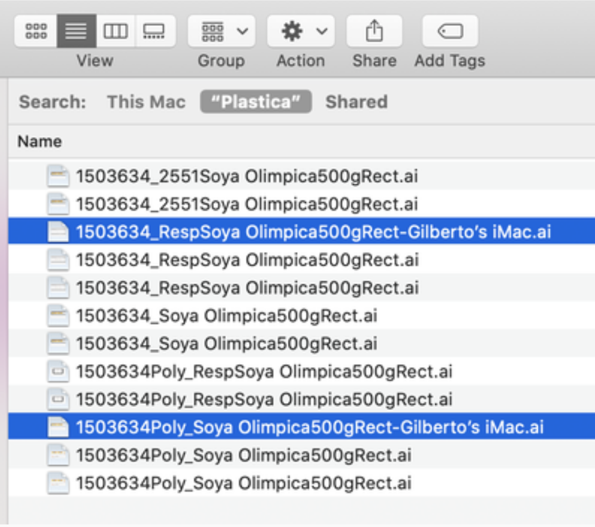
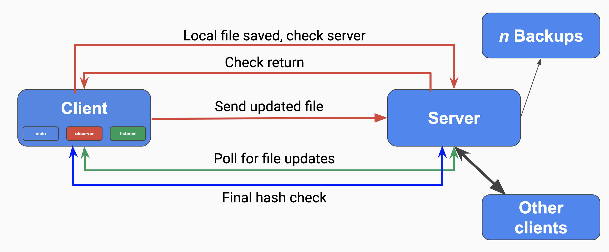

# CS262 Final Project: Engineering Notebook
## Andrew Holmes, Patrick Thornton, Lauren Cooke

As we toss around a number of distributed system concepts for our final project, we're fixating on services such as Google Drive or Microsoft OneDrive, which maintain a consistent file system across multiple computers. We feel it is high time we learn how these services operate under the hood, hence our project: a distributed file system, in which users can upload files to access at any time from any computer.

We'll give ourselves multiple tiers of development for this project:

**First Steps**
 - Users should be able to upload (push) files to a distributed file system.
 - Users should then be able to download (pull) files from said system.
 - Files should synchronize across all computers; only most recent file version available for pulling within the system (we imagine this will necessitate the use of logical clocks).

**Then...**
- Users should be able to share files, such that not only can a user access a file in two different instances of the program, but two different users can access the same file.
- Usual distributed-system spit-and-shine stuff: *n*-fault tolerance via replication, persistence

### Saturday, April 29th

We're working on the very foundations of our system today, starting with the most basic operation our system needs to handle; detecting a file change. (If our system can't tell when a file in its drive is added, altered, or deleted, we're in deep trouble.) After a couple hours of experimentation with implementing this natively in Python, we find **watchdog**, a Python library that appears to be the panacea for our problems; the library, given a directory we can specify using the **os** library, can monitor all changes within that directory in a reliable manner.

We're also taking this initial phase to think about how files differ from chat messages; i.e., how our file system's implementation will differ qualitatively from our work in previous design exercises. There's a number of answers to this question we'll answer in turn, but one can be found in size. We elect to use gRPC for this project (having learned the hard way that pure socket implementations can be a bit of a headache), but gRPC has a 4 MB limit on incoming messages. This was never a problem before, since chat messages could reasonably be capped far before they hit this upper limit. But filesizes routinely exceed this amount.

To remedy the issue, we dig a little deeper into the recesses of gRPC to find these: (https://grpc.io/docs/what-is-grpc/core-concepts/#server-streaming-rpc). Namely, we'll have to employ *streams*, which permit the sending of more than 4 MB of information at once. You may notice that among gRPC's offerings, we find *bidirectional streaming*, which seems to be precisely what we're looking for; after all, we need both uploads to and downloads from our distributed file system. But this is only really necessary when uploads and downloads are simultaneous, and would require the constant maintenance of a bidirectional stream; we're free in our case to summon up a server- or client-side stream depending on our use case, and dismiss it once it's served its purpose.

So we'll stream our files in 10 KB chunks (may adjust this figure in the future) until they're fully sent. For sensibility reasons, we should impose a maximum file size for our drive. We'll arbitrarily select 2 GB, which is roughly the maximum size of a SQL BLOB (Binary Large OBject); that way, our file system should be able to store an arbitrary SQL database.

### Sunday, April 30th

We tumble into another developmental fork in the road. This one has to do with our very particular use case; what ought to happen when two clients try and edit the same file simultaneously? Due to the particular nature of distributed file systems, this situation only really arises in programs like our project, which need to monitor adjustments to existing files.

Since a distributed file system is by no means a new concept, we look at a few places where simultaneous editing of existing files is a problem; DeepNote, Microsoft OneDrive, and Google Drive. The solutions each of these programs provide to this problem can be placed on a spectrum from 'least work' to 'most work':

 - *Least work to implement, oldest-fashioned*: Lock down a file whenever it is being edited, so other clients are simply precluded from contributing. DeepNote kind of works this way; although people can edit the same Jupyter Notebook at the same time, individual cells are locked down when one person begins to edit them, and all other users have to wait for that person to click out of the cell before editing it themselves.
 - *Average work to implement, a compromise*: Allow two different clients to edit the same file at the same time, but save one client's version of the file under a different name, so users are left to handle the manual 'merging' of the two files. This is what Microsoft OneDrive does, as per the following image:
 
	After some poking around, we feel that a MAC address is a suitable identifier for a client; we'll use the Python library **uuid** to grab the client's MAC address and append it to the filename before saving in this particular situation. This avoids the blunt-seeming refusals of the option above, while also avoiding the intricate complications of the option below.
 - *Most work to implement, modern*: Allow two different clients to edit the same file via some sort of in-built concurrent editor, à la Google Drive. This is a hefty amount of work, and as we see it now, might not even make much sense given what we're focusing on (viz. maintaining a consistent file system across many computers/users). 

Of these options, we proceed with the compromise, a.k.a. the Microsoft OneDrive outcome. No matter which outcome we choose, if a user elects to edit a file currently being edited by a different client, they should be warned about the situation before they continue any further.

### Wednesday, May 3rd

By now, our general system architecture is solidified, and is worth detailing here. We provide a system map:
 
An arbitrary number of clients interface with a single server with *n* backups; when we boot the server up, we can specify how many backups we'd like, hence the variable *n*. By this point, we have the basic replication code in place, so a server crashing no longer results in a complete shutdown. We detail further the structure of the client:
 
The client (with a main, observer, and listener thread) has local files saved, which it checks against the server. The *observer thread* uses **watchdog** to monitor its local repositories for updates. When it spots an update, it hashes the updated file and checks the hash against the server's hash of the same file. If the same hash is in the server, we do nothing, as we presume (save the remote possibility of hash collisions) that the client and the server have the same file in storage. If the hash is not found in the server, we stream it over via gRPC, either using the original filename or the original filename plus the MAC address if the MAC address does not match the previous editor's MAC address. We then store the MAC address of the editing client so we can make this exact comparison in the future.

The *listener thread* listens to the server for updates by checking to see if a server's hashes fail to match any of the client's hashes. If it finds a missing file on the server that is not represented locally, it pulls to remedy the discrepancy. If a branched version (i.e. one with a different MAC address) is found on the server, the client is alerted to the situation before continuing.

So the observer thread watches local client repositories for updates, and pushes to the server when they occur; the listener thread watches network server repositories for updates, and pulls from the server when they occur; and the main thread handles the deployment of the aforementioned threads. 
 

